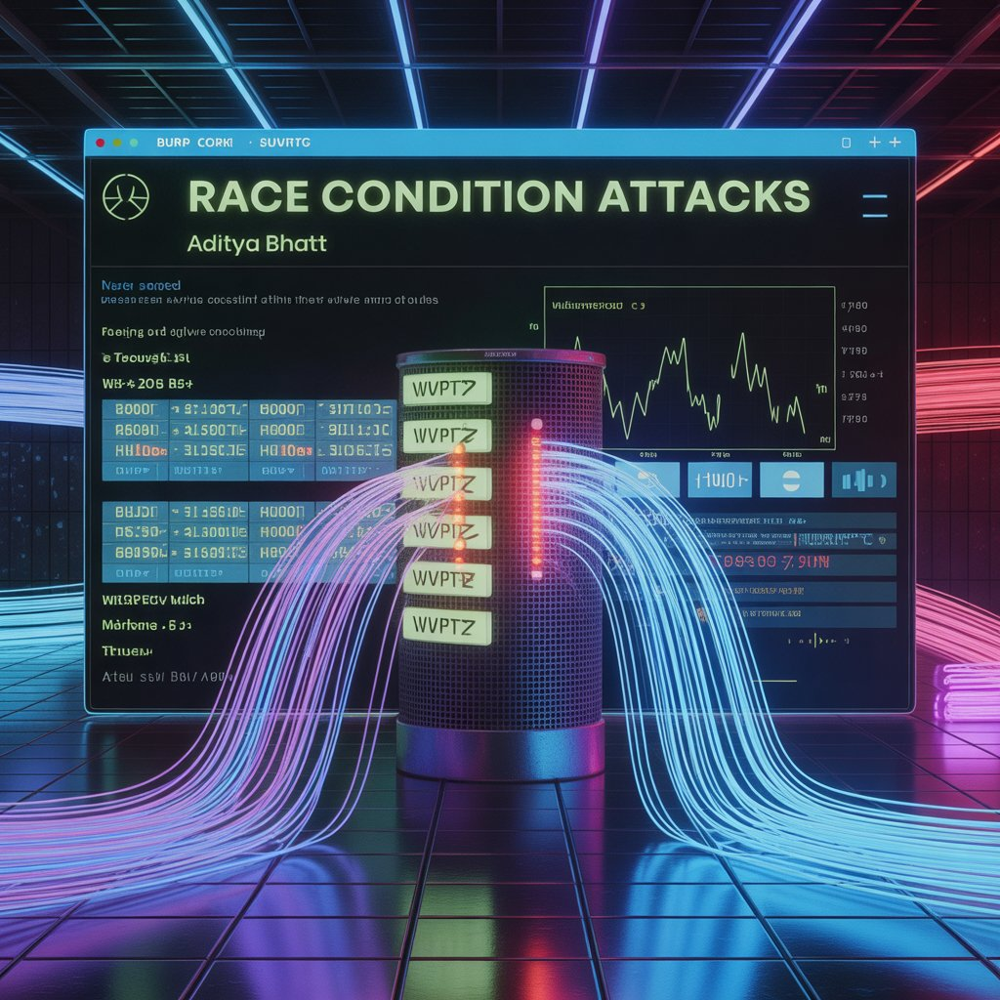
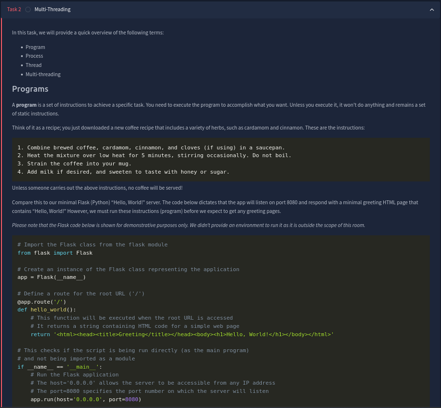
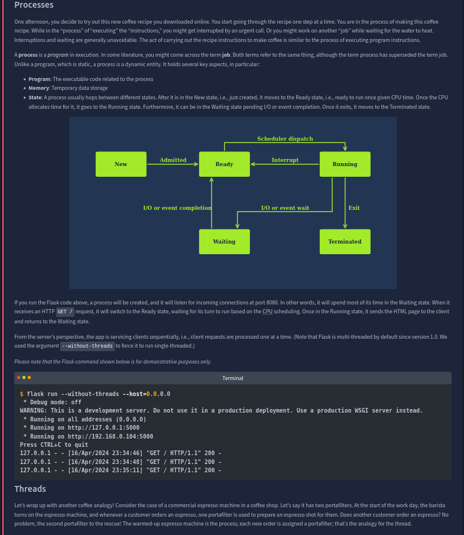
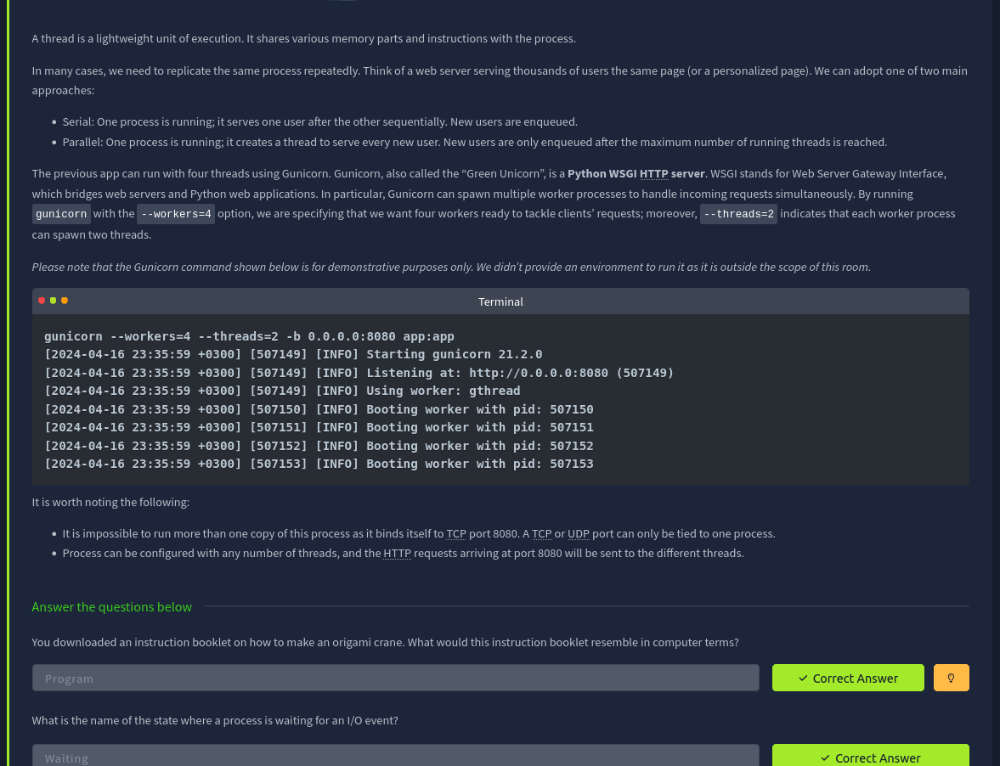
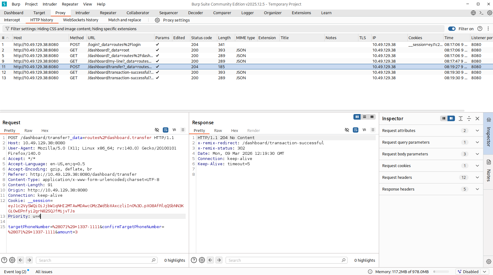
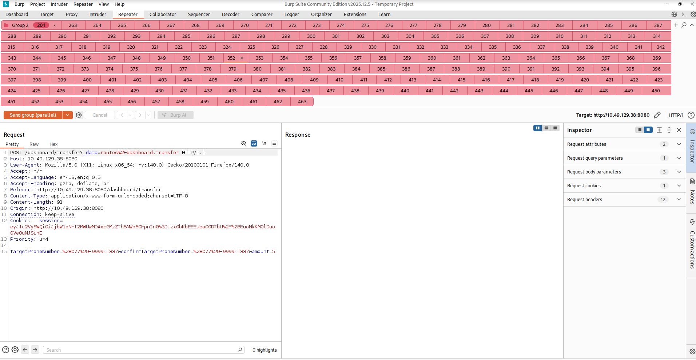
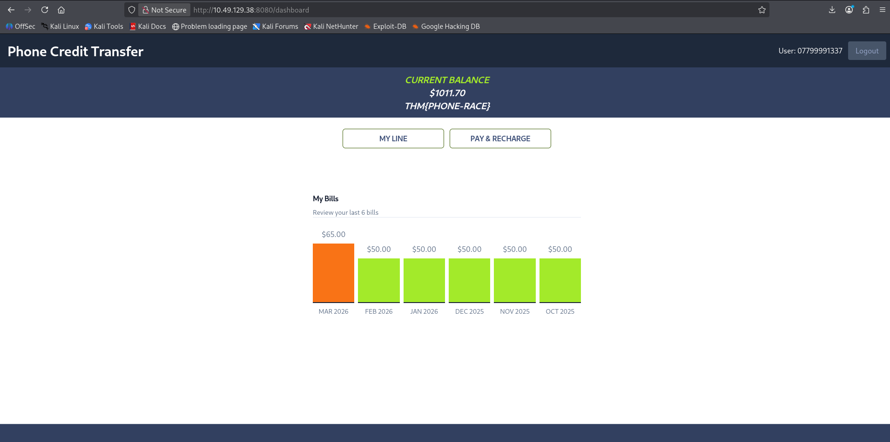
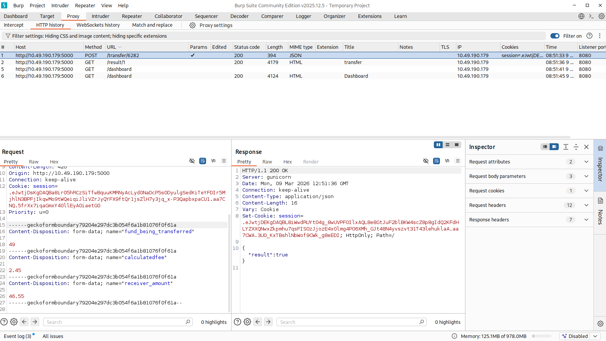
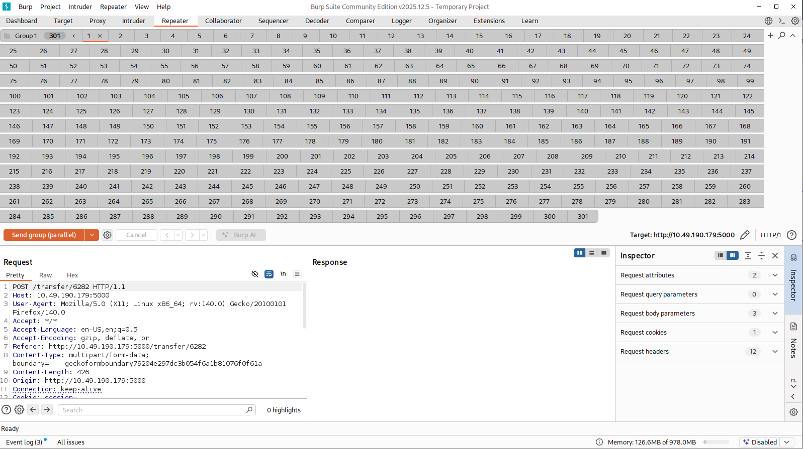

# 🏁 Race Condition Attacks — TryHackMe Walkthrough

**Author:** Aditya Bhatt

Race conditions are among the most subtle yet impactful vulnerabilities in modern web applications. They arise when multiple operations interact with the same resource simultaneously without proper synchronization. When timing becomes the deciding factor for application behavior, attackers can exploit these small windows of opportunity to bypass business logic.

In this lab, we explore how race conditions occur, understand the underlying concepts like threads and processes, and finally exploit the vulnerability using **Burp Suite Repeater** to manipulate application logic.

🔗 **Lab Link:** [https://tryhackme.com/room/raceconditionsattacks](https://tryhackme.com/room/raceconditionsattacks)



---

# Task 1 — Introduction

Imagine testing an online shopping platform. Several questions naturally arise:

* Can a **$10 gift card** be reused to purchase a **$100 item**?
* Can a **discount coupon be applied multiple times** to the same cart?

Surprisingly, the answer might be **yes** if the system is vulnerable to a **Race Condition**.

A **race condition** occurs when multiple threads access and modify shared data simultaneously without proper synchronization. If timing works in the attacker’s favor, operations that should happen sequentially may execute concurrently — allowing unintended outcomes.

For example:

* Applying a discount multiple times
* Performing transactions beyond the account balance
* Reusing one-time tokens or coupons

### Learning Objectives

After completing this room, we learn about:

* Race condition vulnerabilities
* Exploiting race conditions using **Burp Suite Repeater**

Additional concepts covered include:

* Threads and multi-threading
* State diagrams in application logic

Prerequisites include basic knowledge of:

* HTTP protocol
* Web applications
* Burp Suite basics

Once ready — **let the race begin! 🏎️**


---

# Task 2 — Multi-Threading

Before diving into exploitation, it is important to understand a few fundamental computing concepts.

### Programs

A **program** is simply a set of instructions designed to perform a specific task.

Think of it like a **recipe for coffee**:

1. Combine brewed coffee with spices.
2. Heat the mixture for several minutes.
3. Strain the coffee.
4. Add milk or sweetener.

Until someone executes these steps, the recipe remains **static instructions**.

Similarly, the following minimal Flask server only becomes functional when executed.

```
from flask import Flask

app = Flask(__name__)

@app.route('/')
def hello_world():
    return '<html><body><h1>Hello, World!</h1></body></html>'

if __name__ == '__main__':
    app.run(host='0.0.0.0', port=8080)
```

The code defines instructions, but nothing happens until the program is executed.

---

### Processes

A **process** is simply a **program in execution**.

Returning to the coffee analogy:

* The recipe = Program
* Actually preparing the coffee = Process

Processes maintain several key components:

* **Program code**
* **Memory allocation**
* **Execution state**

Typical process states include:

* New
* Ready
* Running
* Waiting
* Terminated

When running the Flask server, the process waits for incoming HTTP requests and serves them sequentially.

Example execution output:

```
$ flask run --without-threads --host=0.0.0.0
Running on http://127.0.0.1:5000
GET / HTTP/1.1 200
GET / HTTP/1.1 200
```



---

### Threads

To better understand **threads**, consider a coffee shop espresso machine.

* The machine itself = **Process**
* Each **portafilter** used to prepare coffee = **Thread**

If the machine has **two portafilters**, two coffee shots can be prepared simultaneously.

This mirrors how servers handle requests:

**Serial Execution**

One request processed at a time.

**Parallel Execution**

Multiple threads handle requests concurrently.

Example using **Gunicorn** with multiple workers:

```
gunicorn --workers=4 --threads=2 -b 0.0.0.0:8080 app:app
```

Important observations:

* Only one process can bind to **port 8080**
* That process may spawn multiple **threads** to handle incoming requests



---

### Questions

**Origami instruction booklet resembles:**
Program

**State where process waits for I/O:**
Waiting



---

# Task 3 — Race Conditions

### Real World Analogy

Imagine calling a restaurant to reserve **Table 17**.

Two hosts check the table simultaneously and both confirm it is available. Because the **reserved tag hasn't yet been placed**, both customers end up booking the same table.

That is a **race condition**.

The problem arises due to a **time gap between checking availability and updating the reservation status**.

---

### Example A

Initial balance: **$100**

Two threads execute withdrawals simultaneously.

* Thread 1 withdraws **$45**
* Thread 2 withdraws **$35**

Both threads check the balance before it is updated.

Possible result:

Thread 1 updates balance → $55
Thread 2 overwrites balance → $65

The account incorrectly shows **$65 remaining**, even though **$80 was withdrawn**.

---

### Example B

Initial balance: **$75**

Two threads withdraw **$50** each.

Both see the balance as $75 and proceed.

Final result: **Account becomes negative**, which should never happen.

These are examples of **Time-of-Check to Time-of-Use (TOCTOU)** vulnerabilities.

---

### Race Condition Code Example

```
import threading

x = 0

def increase_by_10():
    global x
    for i in range(1, 11):
        x += 1
        print(f"Thread {threading.current_thread().name}: {i}0% complete, x = {x}")

thread1 = threading.Thread(target=increase_by_10, name="Thread-1")
thread2 = threading.Thread(target=increase_by_10, name="Thread-2")

thread1.start()
thread2.start()

thread1.join()
thread2.join()
```

Running this script multiple times produces **different outputs** because both threads compete to modify the same variable.

---

### Questions

Does the script guarantee which thread finishes first?

**Answer:** Nay

In the second execution, which thread reached 100 first?

**Answer:** Thread-2

---

# Task 4 — Web Application Architecture

Web applications follow the **client-server model**.

### Client

The browser sends HTTP requests.

### Server

Processes requests and returns responses.

---

### Typical Three-Tier Architecture

1️⃣ **Presentation Layer**
Browser rendering HTML, CSS, JavaScript

2️⃣ **Application Layer**
Backend logic (Node.js, PHP, etc.)

3️⃣ **Data Layer**
Databases such as MySQL or PostgreSQL

---

### Example — Money Transfer

Steps involved:

1. User clicks **Confirm Transfer**
2. Server checks account balance
3. Database responds
4. Transfer is approved or rejected

Initial states:

* Amount not sent
* Amount sent

Updated model introduces a third state:

* Checking balance

---

### Coupon Example

Coupon logic may involve multiple internal states:

* Coupon not applied
* Checking coupon validity
* Checking constraints
* Recalculating totals
* Coupon applied

Final system contains **five states**.

Because there is a **time gap between validation and marking the coupon as used**, multiple requests can exploit the window.

Attackers therefore attempt to send **multiple requests within milliseconds**.

Tools like **Burp Suite Repeater** help achieve this.

---

### Answers

Original states: **2**
Updated states: **3**
Final coupon states: **5**

---

# Task 5 — Exploiting Race Conditions

The provided web application simulates a **mobile operator credit transfer system**.

Credentials provided:

User1
07799991337
pass1234

User2
07113371111
pass1234

The goal is to determine whether the credit transfer system is vulnerable to a race condition.

---

### Capturing the Request

Using **Burp Suite Proxy**, we log in and perform a credit transfer.

We capture the POST request responsible for transferring funds.

The request shows:

* Target phone number
* Transfer amount
* Successful transaction response



---

### Sending Request to Repeater

We send the captured POST request to **Burp Suite Repeater**.

Inside Repeater:

1. Create a **tab group**
2. Duplicate the request multiple times
3. Prepare to send them simultaneously

The idea is to trigger multiple transfers **before the balance update occurs**.

---

### Sequential Requests

When sending requests **sequentially**, each request waits for the previous one to complete.

Most requests fail because the balance is updated between requests.

---

### Parallel Requests

To exploit the vulnerability, we send requests **in parallel**.

Burp sends all duplicated requests within milliseconds, allowing them to pass the balance validation simultaneously.

This results in **multiple successful transfers even though the account lacks sufficient credit**.





The reason this works is because **the application checks the balance before the deduction occurs**. When multiple requests arrive simultaneously, each sees the original balance.

Eventually, this allows us to accumulate more than **$100 credit**.

### Flag

```
THM{PHONE-RACE}
```

---

# Task 6 — Detection and Mitigation

### Detection

Race conditions are notoriously difficult to detect in production.

Signs include:

* Repeated coupon usage
* Duplicate votes
* Unexpected transaction patterns

Penetration testers must first understand **normal application behavior** before attempting to bypass controls.

Tools such as **Burp Suite Repeater** are extremely helpful.

---

### Mitigation Techniques

Several defensive strategies can mitigate race conditions.

**Synchronization mechanisms**

Locks ensure only one thread accesses critical resources.

**Atomic operations**

Operations execute completely without interruption.

**Database transactions**

Ensures all operations succeed or fail as a group.

---

# Task 7 — Challenge Web App

A second challenge application simulates an **online banking system**.

Goal:

Increase one account’s balance to **more than $1000**.

Credentials provided:

Rasser Cond
Username: 4621
Password: blueApple

Zavodni Stav
Username: 6282
Password: whiteHorse

Warunki Wyscigu
Username: 9317
Password: greenOrange

---

### Exploitation Steps

Login using **Rasser Cond**.

Transfer **49** to **Zavodni** and capture the POST request.



Send the request to **Burp Repeater**, duplicate the request multiple times, and send the group **in parallel**.

By exploiting the race condition, multiple transfers execute simultaneously before the balance is updated.



This allows the account balance to exceed **$1000**.

### Flag

```
THM{BANK-RED-FLAG}
```

---

# Conclusion

Race conditions demonstrate how **timing flaws in application logic** can undermine security controls. Even when proper validations exist, a small execution window can allow attackers to bypass restrictions and manipulate system state.

By understanding **threads, processes, and state transitions**, security researchers can identify these vulnerabilities and exploit them effectively during penetration testing.

Tools like **Burp Suite Repeater** provide practical mechanisms to test concurrent requests and reveal race condition vulnerabilities in real-world applications. 🧠⚡

---

# ⭐ Follow Me & Connect

🔗 **GitHub:** [https://github.com/AdityaBhatt3010](https://github.com/AdityaBhatt3010) <br/>
💼 **LinkedIn:** [https://www.linkedin.com/in/adityabhatt3010/](https://www.linkedin.com/in/adityabhatt3010/) <br/>
✍️ **Medium:** [https://medium.com/@adityabhatt3010](https://medium.com/@adityabhatt3010) <br/>

---
